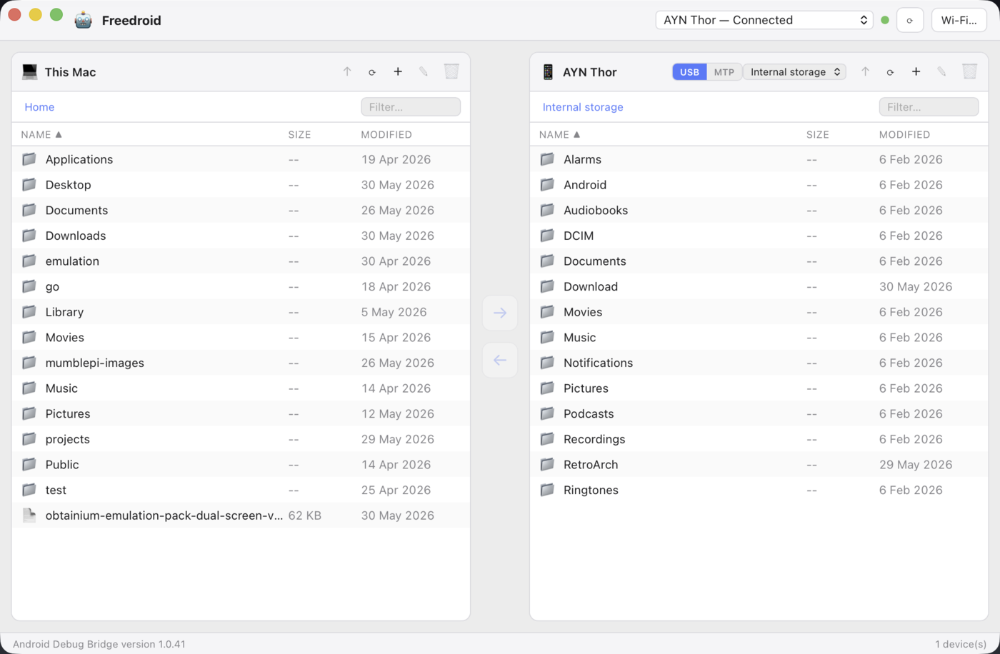

# Freedroid

**Free & open-source Android file transfer for macOS.**

Freedroid lets you browse your Android phone's storage and move files to and from
your Mac through a clean, native-feeling dual-pane interface — over USB or Wi-Fi.
It's a community alternative to closed-source tools like MacDroid and the
discontinued Android File Transfer.

> Freedroid is an independent project. It is not affiliated with, endorsed by, or
> derived from MacDroid or its assets — only its functionality is reimplemented.



## Features

- 📱 **Dual-pane file manager** — Mac on the left, Android on the right, copy either way.
- 🔌 **USB transfer over ADB** — fast, reliable, scriptable.
- 🔓 **MTP mode** — connect **without enabling USB debugging** (native libmtp),
  with the same browse/transfer experience. *(optional `mtp` build)*
- 📶 **Wi-Fi mode** — switch a USB-connected device to wireless, or pair directly
  (Android 11+ wireless debugging).
- 📂 **File operations** on both sides — create folders, rename, delete
  (local deletes go to the Trash).
- 💾 **SD card & storage volumes** — switch between internal storage and an SD card.
- 📊 **Live transfer progress** with speed + ETA, a transfer queue, and cancel.
- 🔎 **Sort, filter, and multi-select** (⌘-click and shift-click range).
- 👁️ **Open files** straight from the device (downloaded to a temp folder first).
- 🆓 **MIT-licensed**, no telemetry, no account, **nothing extra to install**.

## How it works

Freedroid is a [Tauri 2](https://v2.tauri.app) app: a Rust backend drives the
Android Debug Bridge (`adb`), and a Svelte frontend renders the UI. The `adb`
binary is bundled as a sidecar, so there's nothing to install separately.

An optional **MTP backend** (Rust FFI to `libmtp`, behind the `mtp` cargo
feature) lets the app talk to Android over MTP — no USB debugging required. The
default build doesn't include it, so the normal app stays install-free.

## Requirements

- macOS 11+ (Apple Silicon or Intel)
- For the default (ADB) mode, on your phone: **Settings → Developer options →
  USB debugging** enabled (tap *Build number* 7× to reveal Developer options).
  Approve the "Allow USB debugging?" prompt when you first connect.
- For **MTP mode** (the `mtp` build), no developer settings are needed — just set
  the USB connection to **File Transfer / MTP**.

## Development

```bash
# 1. Install toolchains: Rust (rustup), Node 20+, Xcode Command Line Tools
# 2. Fetch the bundled adb sidecar
./scripts/fetch-adb.sh
# 3. Install JS deps and run
npm install
npm run tauri dev
```

Build a release bundle (produces `.app` + `.dmg`):

```bash
npm run tauri build
# universal (Apple Silicon + Intel):
npm run tauri build -- --target universal-apple-darwin
```

### MTP build (connect without USB debugging)

The MTP backend needs `libmtp` at build time and bundles it into the `.app`:

```bash
brew install libmtp
./scripts/build-mtp-dmg.sh   # -> dist/Freedroid_<ver>_aarch64-mtp.dmg (self-contained)
# or just run it during development:
npm run tauri dev -- --features mtp
```

CI builds this self-contained DMG (Apple Silicon) and attaches it to each release.

## Releases & code signing

Pushing a `v*` tag triggers [`.github/workflows/release.yml`](.github/workflows/release.yml),
which builds a universal macOS DMG and attaches it to a draft GitHub Release.

By default the build is **unsigned** — it works, but macOS Gatekeeper shows an
"unidentified developer" warning and users must right-click → Open the first time.
To produce a **signed + notarized** build that opens cleanly, add these repository
secrets (requires a paid Apple Developer account):

| Secret | What it is |
| --- | --- |
| `APPLE_CERTIFICATE` | base64 of your "Developer ID Application" `.p12` |
| `APPLE_CERTIFICATE_PASSWORD` | password for that `.p12` |
| `APPLE_SIGNING_IDENTITY` | e.g. `Developer ID Application: Your Name (TEAMID)` |
| `APPLE_ID` | your Apple ID email |
| `APPLE_PASSWORD` | an app-specific password for notarization |
| `APPLE_TEAM_ID` | your 10-character Team ID |

Then uncomment the `APPLE_*` env block in
[`.github/workflows/release.yml`](.github/workflows/release.yml); `tauri-action`
signs and notarizes automatically when those vars are present. (They're left
commented by default — passing an *empty* `APPLE_CERTIFICATE` makes the bundler
try and fail a certificate import.)

### Project layout

```
src/                  Svelte frontend
  lib/ipc.ts          typed wrappers over the Rust commands
  lib/state.svelte.ts central app state (Svelte 5 runes)
  lib/components/      Pane, DevicePicker, WifiDialog, TransferQueue
src-tauri/src/
  adb/                adb wrapper: devices, files, transfer, wifi
  mtp/                native libmtp FFI backend (optional `mtp` feature)
  local.rs            local (Mac) filesystem listing
  commands.rs         #[tauri::command] surface
```

## Roadmap

- [x] Device detection (USB) with authorization states
- [x] Dual-pane browsing of `/sdcard` and local files
- [x] Push / pull with live progress
- [x] Device file ops (mkdir / rename / delete)
- [x] Wi-Fi mode (tcpip + wireless pairing)
- [x] Drag-and-drop between the panes
- [x] Folder (recursive) transfers
- [x] Cancel transfers; speed + ETA
- [x] Sort / filter / shift-select; open files; local-side file ops
- [x] SD card / storage volume switching
- [ ] Code signing & notarization (config + CI ready; needs an Apple Developer ID)
- [x] MTP mode (connect **without USB debugging**) — native libmtp FFI behind the
  `mtp` feature, with a USB/MTP toggle, storage switching, folder browsing,
  transfers (with live progress via libmtp's callback), open, and delete.
  Verified end-to-end against a real device.
  - Ships as a **self-contained Apple-Silicon DMG** (`libmtp` + `libusb` bundled
    into the `.app`, install names rewritten to `@rpath`): `scripts/build-mtp-dmg.sh`,
    also built in CI and attached to each release.
  - Folder (recursive) MTP transfers are still TODO — select files, not folders.

> Note: dragging files *in from Finder* isn't supported — macOS WebViews can't
> expose dropped files' real paths to HTML5 drag-and-drop, and Tauri's native
> drop handler is mutually exclusive with the in-app pane-to-pane dragging we use.
> Use the **→ / ←** buttons or pane-to-pane drag instead.

> **Not planned:** "Mount as a disk in Finder." On macOS that requires a
> privileged filesystem driver (macFUSE/fuse-t) or a signed FSKit/File-Provider
> extension — all of which mean an extra system install or a paid Apple Developer
> account. Freedroid intentionally stays install-free; the dual-pane manager
> covers the same use cases.

## License

[MIT](LICENSE). `adb` is redistributed under the Apache License 2.0 as part of
the Android SDK platform-tools.
